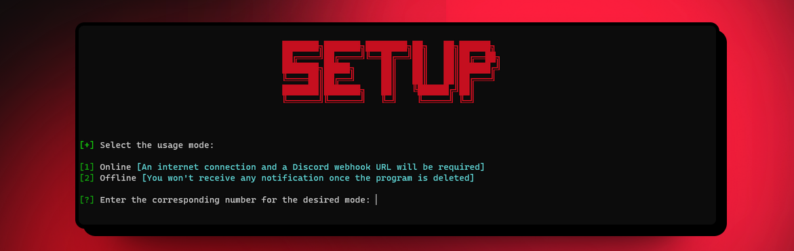

</img>
# ProcessWipe
[](https://www.gnu.org/licenses/old-licenses/gpl-2.0.en.html)


<p align="justify">Have you ever compromised a computer and needed to delete the backdoor on a certain date? With this GitHub project, you can create your own executable that allows you to remove the process and file without a trace.

> :warning: **Disclaimer**: All content in this project is intended for security research purpose only.
<p align="center">
  <a href="#features">Features</a> •
  <a href="#installation">Installation</a> •
  <a href="#usage">Usage</a> •
  <a href="#screenshots">ScreenShots</a> •
  <a href="#demostration">Demostration</a> 
</p>


## Features

 

#

### Integrated Compiler:

- **Compiler:** Quickly compile .py files into exe.
- **Custom Icons:** Add custom icons to the exe.
- **Manual Compilation:** Have the option to compile manually when needed.

### Online Mode:

- **Customizable Dates:** Set specific dates where the action is executed.
- **Discord Integration:** Receive notifications along with images directly on Discord.
- **Offline Functionality:** Seamlessly operate even when disconnected from the internet.

### Offline Mode:

- **Operate:** The script carries out its operations without the need for an internet connection.

## Installation

### Requirements:

- **Operating System:** Windows 10 / 11
- **Python Version:** 3.10.9 <a href="https://www.python.org/downloads/release/python-3109/" target="_blank">(Recommended)</a>
- **Discord:** You'll need a discord webhook if you are going to use the Online Mode.

**Step 1:** Clone or download this repo on your machine

```shell
$ git clone https://github.com/J12C/ProcessWipe.git
```
      
**Step 2**: Install some libraries

```shell
$ pip3 install colorama psutil requests pyautogui
```

**Step 3**: Install PyInstaller

```shell
$ pip3 install pyinstaller
```

**Step 4**: Get into the folder

```shell
$ cd ProcesWipe
```

**Step 5**: Run it!

```shell
$ start.bat
```


## Usage

Once all the requirements are satisfied, you can proceed with the following steps to use the project:


</img>

**Step 1:** Execute `start.bat` to initiate the process.

**Step 2:** Choose betewen `Online Mode` or `Offline Mode` based on the use case.

**Step 3:** Configure the script

**Step 4:** Choose betewen `Compile` or not 

**Step 5:** Choose betewen add an `icon` or not.

**Step 6:** Enjoy!

## ScreenShots

**1. Settings:**

**2. Compiler:**

**3. Discord:**

## Demostration

**1. Setup**

https://github.com/J12C/ProcessWipe/assets/141021768/454cc12f-4b17-4581-8154-3133dd62b859


